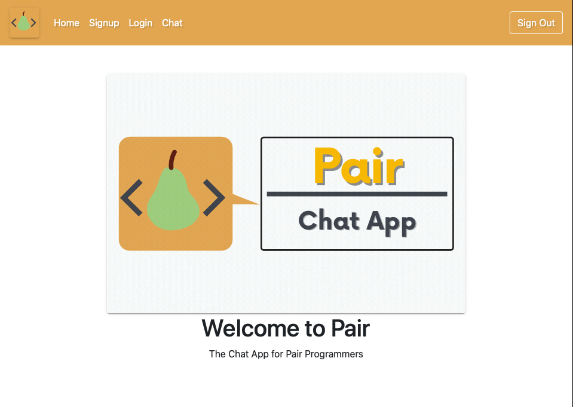
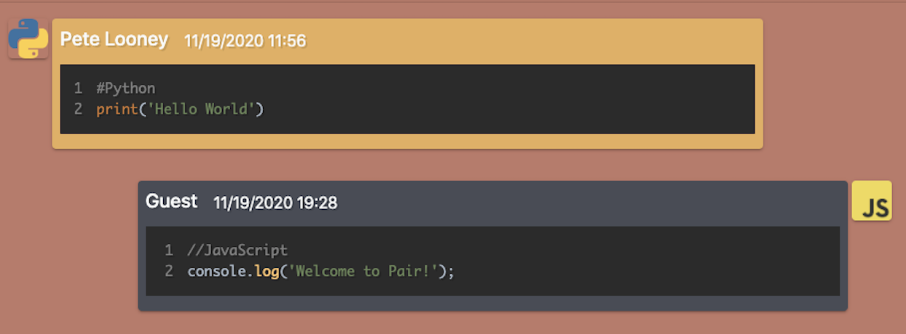
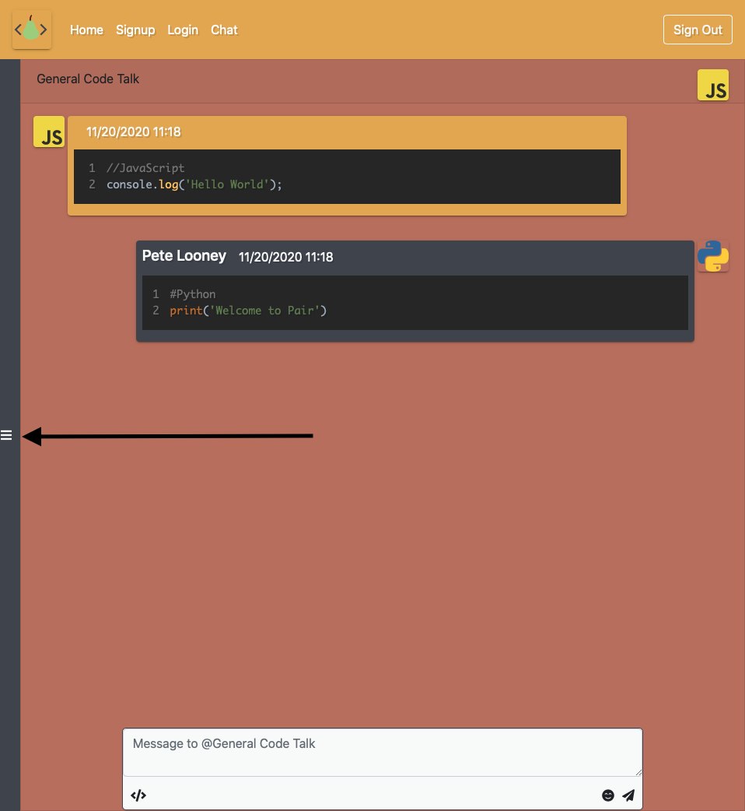
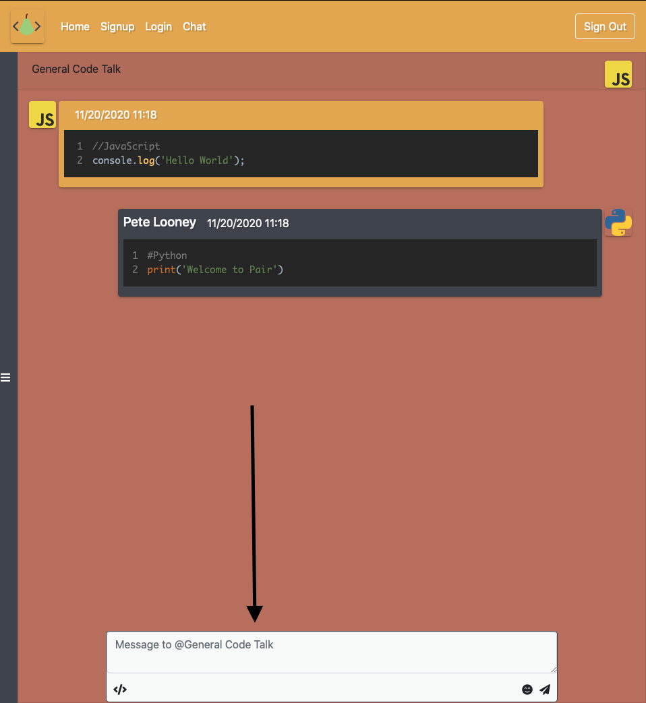
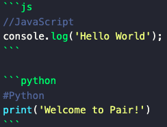

# **Welcome to [Pair](https://pair-chat.netlify.app) 👋** <!-- omit in toc -->


* Pair is a chatting application which allows coders to send messages in realtime.


<!-- 
<hr> -->

- [**General**](#general)
  - [Technology and Frameworks Used:](#technology-and-frameworks-used)
  - [Project Contributors:](#project-contributors)
- [How To Use:](#how-to-use)
  - [Signup/Login](#signuplogin)
  - [Navigating Chat Groups](#navigating-chat-groups)
  - [Sending Messages and Code Snippets](#sending-messages-and-code-snippets)
  - [Changing Profile Information](#changing-profile-information)

<hr>

## **General**


### Technology and Frameworks Used:


  
Pair was built with using React, Redux, Firebase Authentication, Firebase Realtime Database, Firebase Storage, and React-Bootstrap.
Pair also utilizes React-markdown and React-Syntax-Highlighter to render code snippets in different programming languages.
  


### Project Contributors:
* Peter Looney <a href='https://github.com/plooney81'></a><a href='https://www.linkedin.com/in/peter-looney-27b732166/'></a>

<hr>

<!-- Explain how the project works:
* Include some code snippets -->

## How To Use:

### Signup/Login
1. To use Pair, please click [this](https://pair-chat.netlify.app) link and navigate to the signup page.
2. Their are mutliple ways to sign up in Pair:
   1. Email and password
   2. Google
   3. GitHub
3. To utilize the Google or GitHub sign up features, simply click the respective button and follow the directions in the popup.
4. To utilize the email and password sign up features, simply add your preferred email and password into their respective text boxes on the page and click the sign up button.
5. After successful signup you will be redirected to the chat page.
6. Alternatively, if you have already signed up with Pair, you can navigate to the login page where you will see the same three options.


### Navigating Chat Groups
1. To start chatting, you must either subscribe to one of the already created chat groups, or create your own.
2. To view the groups, click the button on the left hand side of the screen.
3. Click the plus button on any group under the heading "Join a group" to subscribe to it.
4. To view the chat for a specific group:
   1. You must first be subscribed to that group.
   2. Simply click on the groups name, two things will happen once clicked.
      1. The Group selection sidebar will close
      2. The Messages for the chat will appear in the screen to the right.
5. To create a new group, the group sidebar must first be displayed.
6.  Find the section that says create a group
7.  Click in the text box and type in the preffered name for your group.
8.  Click add, and you will see the newly created group has been added to your current group section.


### Sending Messages and Code Snippets
1. Once you have have subscribed and clicked on a group you can start chatting.
2. To send a message, find the text area towards the bottom right hand side of the chat page.
3. Simply start typing and then hit the paper plane to send the message to the group.
4. To send code snippets, they must utilize markdown's code block [syntax](https://www.markdownguide.org/extended-syntax/).
5. Alternatively, you could send snippets in regular text, but the syntax highlighting will not appear for the message.
6. Here is an example of how to utilize the syntax highlighter.
   
   

   Which will render as:

   

### Changing Profile Information
1. To update profile information, click on the profile image that is located on the upper right hand corner of the chat page.
   
   

2. Once clicked, a modal will appear where you can update your email address, displayed name, or profile picture.

<!-- ### Demo: -->

<!-- <hr> -->
<!-- 
## **Description and Requirements**  

<!-- <hr> -->

<!-- ## **Lessons Learned** -->

<!-- ## **Credit** and **Licenses** -->


<!-- ```js
//JavaScript
console.log('Hello World');
```

```python
#Python
print('Welcome to Pair!')
``` -->